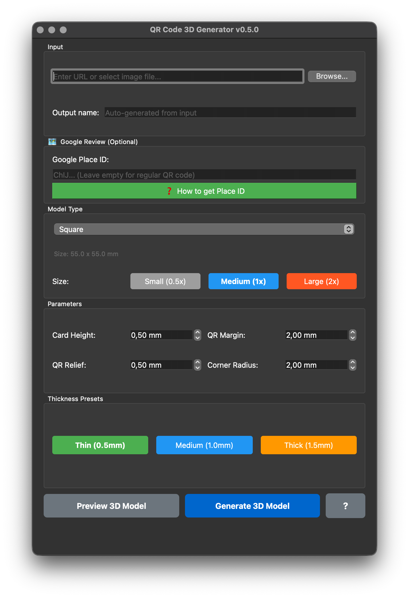
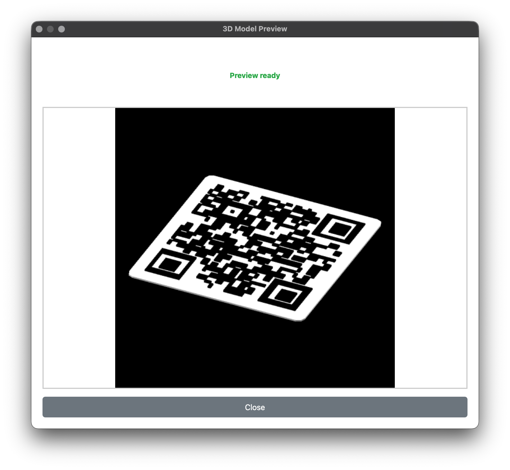
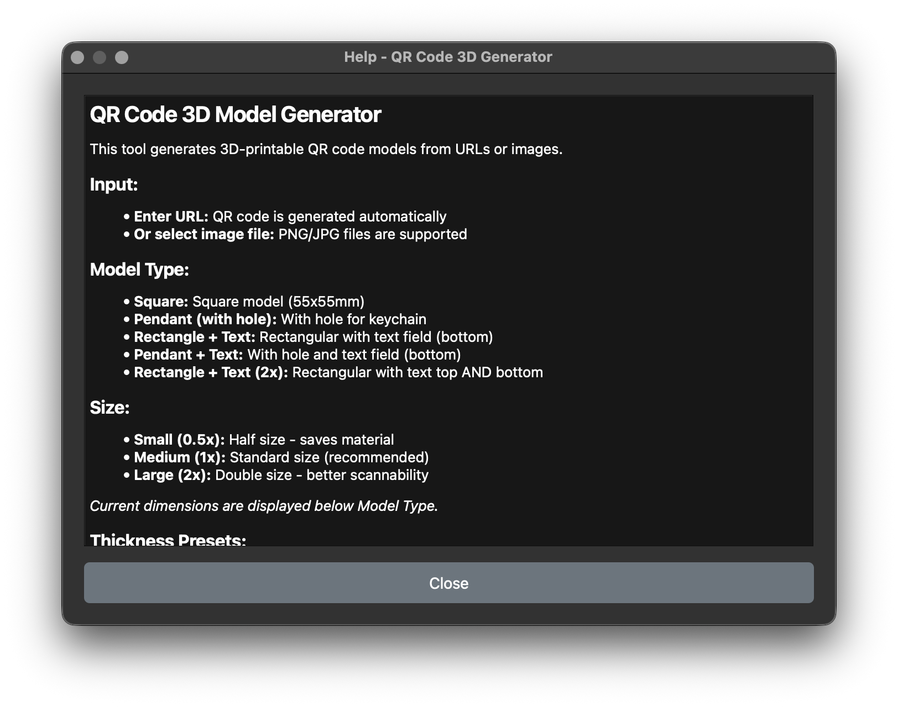

# QR Code 3D Model Generator

Automatically generate 3D-printable QR code models from URLs or PNG/JPG images - with desktop GUI or command line.








## Version 0.3.3 - Latest Updates

**New Features:**
- **Dynamic Text Scaling**: Text size automatically scales with model size (Small/Medium/Large) - 3mm/6mm/12mm for 0.5x/1x/2x scale
- **Scaled Text Margins**: Text spacing adjusts dynamically (1mm/2mm/4mm) based on model size for perfect proportions
- **Enhanced Drag & Drop**: Supports rectangle-text-2x mode and loads both top/bottom text from JSON metadata
- **Synchronized Relief Heights**: QR code and text relief always have the same height for consistent appearance
- **Dynamic Relief Label**: UI label updates based on model type ("QR Relief:" vs "QR/Text Relief:")
- **Smart Output Naming**: Auto-generated folder names include size (small/medium/large) and thickness (thin/medium/thick) labels
- **Optimized macOS Build**: PyInstaller-based .app bundle with 85% smaller size (VTK/PyVista excluded)

**Bug Fixes:**
- Fixed text overflow on Small models (0.5x scale)
- Fixed text being too small on Large models (2x scale)
- Fixed missing rectangle-text-2x mode in drag & drop mapping
- Fixed missing content_top loading from JSON files

**Improvements:**
- Text and margins now scale proportionally with model size
- Better visual balance across all size presets
- More reliable JSON metadata loading
- Faster workflow with optimized build size

## Features

- **Desktop GUI**: User-friendly application with real-time parameter preview and 3D model preview
- **3D Preview**: See how your model will look before generating with OpenSCAD rendering
- **Drag & Drop**: Load all settings by dropping JSON metadata files onto the GUI
- **URL Support**: Generate QR codes directly from URLs
- **Four Modes**:
  - Square (55x55mm)
  - Pendant with keychain hole (55x61mm)
  - Rectangle with text (54x64mm)
  - Pendant with text (55x65mm)
- **Text Function**: Optional embossed text (max. 20 characters) below QR code
- **Dynamic Text Sizing**: Automatic scaling 3-6mm based on text length - always fits perfectly!
- **Text Rotation**: 180° rotation for better readability (automatic for Pendant+Text)
- **Optimized Size**: QR code uses almost the entire card surface (minimal margin)
- **Relief QR Code**: Embossed black pixels (1mm)
- **Rounded Corners**: 2mm radius for professional design
- **Lightning-Fast Performance**: ~1 second per model with OpenSCAD 2025+ (126x faster than older versions!)
- **Size Presets**: Quick selection of Small (0.5x), Medium (1x), or Large (2x) model dimensions
- **Thickness Presets**: One-click thickness adjustment - Thin (0.5mm), Medium (1.0mm), or Thick (1.5mm)
- **Automatic STL Generation**: Print-ready output
- **JSON Metadata Export**: Each model gets a JSON file with complete configuration
- **Organized Output**: Each model in its own subfolder with all files (PNG, SCAD, STL, JSON)
- **🗺️ Google Review QR Codes**: Generate direct review links from Google Place IDs

### 🗺️ Google Review QR Codes (NEW in v0.4.0)

Generate QR codes that link **directly** to your Google Business review page! Perfect for restaurants, shops, and businesses.

**How it works:**
1. Get your Google Place ID (see guide below)
2. Enter it in Qrly (GUI or CLI)
3. Get a QR code with direct review link!

**✅ Simple & Reliable:**
- Only requires a Place ID (ChIJ...)
- No complex URL parsing
- Always generates correct review links
- Works in GUI and CLI

**How to get a Google Place ID:**

**Method 1: Official Google Place ID Finder** (Recommended)
1. Visit: https://developers.google.com/maps/documentation/places/web-service/place-id
2. Scroll down to the **"Place ID Finder"** widget
3. Search for your business (e.g., "celox.io Berlin")
4. Select your business from suggestions
5. Copy the Place ID (starts with `ChIJ`)

**Method 2: Browser Inspector**
1. Open Google Search: "Your Business Name + City"
2. Right-click on "Write a review" button (Knowledge Panel)
3. Select "Inspect" / "Element untersuchen"
4. In Developer Tools: Ctrl+F → Search for `data-pid`
5. Copy the value (e.g., `data-pid="ChIJ..."`)

**Method 3: Google My Business Dashboard**
1. Login: https://business.google.com/
2. Select your business
3. Navigate to: Info → Advanced Information → Place ID
4. Copy the Place ID

**Example Place ID:**
```
ChIJp4JiUCNP0xQR1JaSjpW_Hms
```

---

### 📖 Complete Step-by-Step Guide

#### Why Place IDs Matter

**The Problem:**
Standard Google Maps URLs often contain only a **CID** (Customer ID in format `0x...:0x...`), not a real Place ID.

**CID vs Place ID:**
- ❌ CID: `0x47bd7b12516c75ff:0xf1cbcad05d451d78` - Does NOT work for review links
- ✅ Place ID: `ChIJ...` - Works for direct review links

**Why PlusCode Doesn't Work:**
PlusCode (e.g., `9F4FFRJ7+G8`) is only a **geographic coordinate**, not a business identifier.
- ✅ PlusCode: Good for location sharing
- ❌ PlusCode: Contains NO Place ID
- ❌ PlusCode: Cannot link to business reviews

---

#### Method 1: Google Place ID Finder (Easiest)

**Step 1: Open the Tool**
Visit: https://developers.google.com/maps/documentation/places/web-service/place-id

**Step 2: Scroll down to "Place ID Finder" widget**

**Step 3: Search for your business**
```
Your Business Name + City
Example: "Restaurant Berlin" or "Coffee Shop New York"
```

**Step 4: Select your business from suggestions**

**Step 5: Copy the Place ID** (looks like: `ChIJ...`)

**Step 6: Use with Qrly**

**CLI:**
```bash
./venv-gui/bin/python -m qrly \
    --place-id "ChIJ_YOUR_PLACE_ID" \
    --mode rectangle-text \
    --text "REVIEW US!" \
    --name my-business-review
```

**GUI:**
1. Start: `./venv-gui/bin/python -m qrly.app`
2. Paste Place ID into field
3. Enter text (optional)
4. Select mode: Rectangle + Text
5. Click "Generate 3D Model"

**Step 7: Verify**
Test your Place ID in browser:
```
https://search.google.com/local/writereview?placeid=ChIJ_YOUR_PLACE_ID
```
✅ Should open directly to your business review form!

---

#### Method 2: Browser Inspector (Alternative)

If the official tool doesn't work:

**Step 1: Open Google Search**
```
https://www.google.com/search?q=Your+Business+Name+City
```

**Step 2: Right-click on "Write a review" button** (in Knowledge Panel on right side)

**Step 3: Select "Inspect" / "Inspect Element"**

**Step 4: In Developer Tools: Ctrl+F (or Cmd+F on Mac)**

**Step 5: Search for: `data-pid`**

**Step 6: Copy the value** (after `data-pid="..."`)

**Example HTML:**
```html
<button data-pid="ChIJxxx..." ...>Write a review</button>
                    ^^^^^^^^^
                    This is your Place ID!
```

---

#### Method 3: Google My Business Dashboard

**Step 1: Login**
Visit: https://business.google.com/

**Step 2: Select your business**

**Step 3: Navigate to:**
```
Info → Advanced Information → Place ID
```

**Step 4: Copy the Place ID**

---

#### Success Checklist

- [ ] Google Place ID Finder opened
- [ ] Business searched and selected
- [ ] Place ID copied (starts with ChIJ)
- [ ] Tested in browser: `https://search.google.com/local/writereview?placeid=...`
- [ ] Review form opens directly ✅
- [ ] QR code generated with Qrly
- [ ] QR code tested with phone
- [ ] QR code leads directly to review form ✅

---

#### Fallback Option

If you can't get a Place ID, you can still create a QR code with a standard Google Maps URL:

```bash
./venv-gui/bin/python -m qrly \
    "https://www.google.com/maps/place/Your+Business/@lat,lng" \
    --mode rectangle-text \
    --text "FIND US" \
    --name business-location
```

✅ QR code will be created
⚠️ Leads to Maps page (not directly to review form)
ℹ️ Users must click "Write a review" manually

---

#### Summary

**Best Method:** Google Place ID Finder Tool
- No API required
- Official Google solution
- Works reliably

**URL:** https://developers.google.com/maps/documentation/places/web-service/place-id

**Result:** Real Place ID (ChIJ...) → Direct review links ✅

### 🌟 Intelligent Text Scaling

The generator uses **intelligent dynamic text scaling** that automatically calculates the optimal font size:

- **Short Text** (1-7 characters): Maximum size of 6mm for optimal readability
- **Medium Text** (8-14 characters): Automatically scaled between 4-5mm
- **Long Text** (15-20 characters): Scaled to minimum 3mm, fits perfectly!

**Examples:**
- "LOGO" → 6.00mm (large and readable)
- "berlinometer" → 4.79mm (balanced)
- "berlinometer.de" → 3.83mm (compact, fits perfectly)
- 20 characters → 3.06mm (smaller but readable)

**Technical Background:**
The calculation considers card size, QR margins, and a 4mm safety buffer. With default settings (qr_margin=0.5mm), all texts from 1-20 characters are **guaranteed** to fit within model boundaries - no overflow, no manual adjustments needed!

## Quick Start

### 1. Installation (one-time)

```bash
# Install OpenSCAD (for STL export)
brew install openscad

# Install Python package (editable mode)
pip install -e .

# Alternative: Use virtual environment
# Python 3.13 virtual environment in venv-gui/
# ./venv-gui/bin/pip install -e .
```

### 2. Start GUI Application (recommended)

```bash
# After pip installation:
qrly

# Or with virtual environment:
./venv-gui/bin/python -m qrly.app
```

**GUI Features:**
- Enter URL or select image file
- Choose mode (Square/Pendant/Rectangle+Text/Pendant+Text)
- Optional: Enter text (max 20 characters)
- Adjust parameters (height, margin, relief, corner radius)
- Select size preset: Small (0.5x), Medium (1x), or Large (2x)
- Select thickness preset: Thin (0.5mm), Medium (1.0mm), or Thick (1.5mm)
- Click "Generate 3D Model"
- Track progress in real-time
- Files automatically saved to `generated/`

### 3. Command Line (Alternative)

#### From URL (easiest way):

```bash
# With shell script:
./scripts/qr_generate.sh https://your-website.com --mode pendant --name my-site

# Or directly with Python (after pip install -e .):
qrly https://your-website.com --mode pendant --name my-site
```

#### From Image File:

```bash
./scripts/qr_generate.sh myqr.png --mode square
```

## Usage

### GUI Application

**Start:**
```bash
./venv-gui/bin/python -m qrly.app
```

**Operation:**
1. **Input**: Enter URL (e.g., `https://example.com`) or select PNG/JPG file
2. **🗺️ Google Review** (Optional):
   - Enable "Generate Google Review Link" checkbox
   - Paste Google Maps URL or Place ID
   - App automatically extracts Place ID and generates review link
   - Business name auto-fills as text label
3. **Output Name**: Optional - automatically derived from URL
4. **Model Type**: Choose from 4 modes:
   - Square (55x55mm) - Classic square
   - Pendant (with hole) - With keychain hole
   - Rectangle + Text (54x64mm) - Rectangle with text field
   - Pendant + Text (55x65mm) - Pendant with text field
5. **Size**: Select preset button:
   - Small (0.5x) - Half size, saves material
   - Medium (1x) - Standard size (recommended)
   - Large (2x) - Double size, better scannability
6. **Text**: For text modes: Enter text (max 20 characters)
7. **Text Rotation** (Rectangle+Text only): Optional "Rotate text 180°" checkbox for upside-down text
   - Pendant+Text automatically rotates text 180°
8. **Adjust parameters**:
   - Card Height: 0.5-5mm (default: 1.25mm)
   - QR Margin: 0-10mm (default: 0.5mm)
   - QR Relief: 0.1-2mm (default: 1mm)
   - Corner Radius: 0-5mm (default: 2mm)
9. **Thickness Presets**: Quick selection:
   - Thin (0.5mm) - Faster printing, less material
   - Medium (1.0mm) - Balanced
   - Thick (1.5mm) - More stable, better readability
10. **Click "Generate 3D Model"**
11. Wait (~1 second with OpenSCAD 2025+)
12. ✅ Success! Files in `generated/model-name/` folder

### Output Organization

Each generated model gets its own subfolder in `generated/` with automatic size and thickness labels:

**Naming Format:** `{name}-{size}-{thickness}`
- **Size**: `small` (0.5x), `medium` (1.0x), `large` (2.0x)
- **Thickness**: `thin` (≤0.6mm), `medium` (0.7-1.3mm), `thick` (≥1.4mm)

```
generated/
├── my-site-medium-medium/       # Standard: 1.0x scale, 1.25mm height
│   ├── my-site-medium-medium.png
│   ├── my-site-medium-medium.json
│   ├── my-site-medium-medium.scad
│   └── my-site-medium-medium.stl
├── github-large-thin/           # Large: 2.0x scale, 0.5mm height
│   ├── github-large-thin.png
│   ├── github-large-thin.json
│   ├── github-large-thin.scad
│   └── github-large-thin.stl
└── example-small-thick/         # Small: 0.5x scale, 1.5mm height
    ├── example-small-thick.png
    ├── example-small-thick.json
    ├── example-small-thick.scad
    └── example-small-thick.stl
```

**Benefits:**
- Instant visual identification of model specifications from folder name
- No need to open files to check size/thickness settings
- Better organization when generating multiple variants

**JSON Metadata** contains:
- Timestamp and version
- Used mode (square/pendant/rectangle-text/pendant-text)
- QR input (URL or filename)
- All dimensions (card size, QR size, pixel size, grid)
- All parameters (margins, relief, corner radius)
- Mode-specific data (e.g., hole diameter for pendant)
- Text data (content, size, rotation for text modes)

**Advantage:** Easy reproduction with exactly the same settings!

### Command Line

#### From URL:

**Basic:**
```bash
./scripts/qr_generate.sh https://example.com
```

**With Options:**
```bash
./scripts/qr_generate.sh https://github.com/user/repo --name github --mode pendant
```

**Website with Parameters:**
```bash
./scripts/qr_generate.sh "https://example.com/profile?user=123" --name profile
```

**With Text (Rectangle+Text):**
```bash
./scripts/qr_generate.sh https://example.com --mode rectangle-text --text "AIMPLICITY" --name mycard
```

**With Text (Pendant+Text):**
```bash
./scripts/qr_generate.sh https://github.com/user --mode pendant-text --text "GitHub" --name github
```

**With Rotated Text (Rectangle+Text):**
```bash
./venv-gui/bin/python -m qrly https://example.com --mode rectangle-text --text "ROTATED" --text-rotation 180 --name mycard-rot
```

#### 🗺️ Google Review QR Codes:

**From Place ID:**
```bash
./venv-gui/bin/python -m qrly \
    --place-id "ChIJp4JiUCNP0xQR1JaSjpW_Hms" \
    --mode rectangle-text \
    --text "REVIEW US!" \
    --name my-business-review
```

**Square mode:**
```bash
./venv-gui/bin/python -m qrly \
    --place-id "ChIJp4JiUCNP0xQR1JaSjpW_Hms" \
    --mode square \
    --name restaurant-review
```

**Pendant mode with text:**
```bash
./venv-gui/bin/python -m qrly \
    --place-id "ChIJp4JiUCNP0xQR1JaSjpW_Hms" \
    --mode pendant-text \
    --text "RATE US" \
    --name keychain-review
```

#### From Image File:

**Square:**
```bash
./scripts/qr_generate.sh myqr.png
```

**Pendant:**
```bash
./scripts/qr_generate.sh celox.png --mode pendant
```

**With Custom Output:**
```bash
./scripts/qr_generate.sh qrcode.jpg --mode square --output ./stl_files
```

### Parameters

| Parameter | Description | Default |
|-----------|-------------|---------|
| `input` | QR code image file (PNG/JPG) or URL (optional if --place-id used) | *required* |
| `--mode` | Mode: `square`, `pendant`, `rectangle-text`, `pendant-text` | `square` |
| `--text`, `-t` | Text below QR code (max 20 characters, only for *-text modes) | *(empty)* |
| `--text-rotation` | Rotate text 180° (0 or 180, auto for pendant-text) | `0` |
| `--output`, `-o` | Output directory | `generated` |
| `--name`, `-n` | Base name for output files | *derived from input* |
| `--google-review` | Generate Google Review link from Maps URL or Place ID | `false` |
| `--place-id` | Google Place ID (alternative to URL, implies --google-review) | *(none)* |

## Modes in Detail

### Square Mode

- **Dimensions**: 55 x 55 x 1.25 mm
- **Margins**: 0.5mm all around (default)
- **QR Code Area**: ~54 x 54 mm
- **QR Relief**: 1mm embossed
- **Use Cases**: Business cards, labels, inserts

```
┌─────────────────┐
│    0.5mm        │
│  ┌─────────┐    │
│.5│ QR Code │.5  │
│  └─────────┘    │
│    0.5mm        │
└─────────────────┘
```

### Pendant Mode

- **Dimensions**: 55 x 61 x 1.25 mm
- **Margins**: 0.5mm (sides/bottom), 8mm (top for hole)
- **Hole**: ⌀5mm, 6mm from top edge
- **QR Code Area**: ~54 x 54 mm
- **QR Relief**: 1mm embossed
- **Use Cases**: Keychains, necklaces, luggage tags

```
┌─────────────────┐
│     6mm    ●    │ ← Hole (⌀5mm)
│     2mm         │
│  ┌─────────┐    │
│.5│ QR Code │.5  │
│  └─────────┘    │
│    0.5mm        │
└─────────────────┘
```

### Rectangle + Text Mode

- **Dimensions**: 54 x 64 x 1.25 mm
- **Margins**: 0.5mm all around
- **QR Code Area**: ~53 x 53 mm
- **QR Relief**: 1mm embossed
- **Text**: Embossed (1mm), dynamic 3-6mm height (auto-scaled), max 20 characters
- **Text Spacing**: 2mm below QR code
- **Font**: Liberation Mono Bold (Monospace)
- **Use Cases**: Business cards, labeled tags, personalized cards

```
┌─────────────────┐
│    0.5mm        │
│  ┌─────────┐    │
│.5│ QR Code │.5  │
│  └─────────┘    │
│   2mm           │
│   TEXT HERE     │ ← Embossed 1mm
│    0.5mm        │
└─────────────────┘
     64mm
```

### Pendant + Text Mode

- **Dimensions**: 55 x ~65 x 1.25 mm (length varies with text)
- **Margins**: 0.5mm (sides/bottom), 8mm (top for hole)
- **Hole**: ⌀5mm, 6mm from top edge
- **QR Code Area**: ~54 x 54 mm
- **QR Relief**: 1mm embossed
- **Text**: Embossed (1mm), dynamic 3-6mm height (auto-scaled), max 20 characters
- **Text Spacing**: 2mm below QR code
- **Font**: Liberation Mono Bold (Monospace)
- **Use Cases**: Personalized keychains, labeled luggage tags

```
┌─────────────────┐
│     6mm    ●    │ ← Hole (⌀5mm)
│     2mm         │
│  ┌─────────┐    │
│.5│ QR Code │.5  │
│  └─────────┘    │
│   2mm           │
│   TEXT HERE     │ ← Embossed 1mm
│    0.5mm        │
└─────────────────┘
    ~65mm
```

## Design Specifications

| Property | Value |
|----------|-------|
| Card Width | 55mm (ISO 7810) or 54mm (Rectangle-Text) |
| Card Height | 1.25mm (adjustable via thickness presets) |
| QR Code Relief | 1mm embossed |
| Corner Radius | 2mm |
| Margin Width | **0.5mm** (default, adjustable 0-10mm) |
| QR Code Border | **1 module** (minimal for maximum area) |
| Top Margin (Pendant) | 8mm |
| Hole Diameter | 5mm |
| Hole Position | 6mm from top edge, horizontally centered |
| **Text Size** | **3-6mm** (dynamically scaled based on text length) |
| **Text Relief** | **Always synced with QR Relief** (ensures consistent height) |
| **Text Spacing** | **2mm** (distance to QR code) |
| **Text Font** | **Liberation Mono Bold** (Monospace) |
| **Text Rotation** | **0° or 180°** (Rectangle: selectable, Pendant: automatic 180°) |

## Output Files

All generated files are automatically placed in the **`generated/`** folder.

For input `https://example.com` with `--name example`:

- **`generated/example.png`**: QR code image (for URL input)
- **`generated/example-model.scad`**: OpenSCAD source file (editable, parametric)
- **`generated/example-model.stl`**: 3D print file (directly printable)

## Performance

### Generation Time

The system uses intelligent **pixel sampling** for optimal performance:

| Phase | Time | Description |
|-------|------|-------------|
| QR Code Generation | < 1 sec | PNG from URL or load image |
| OpenSCAD File | < 1 sec | Generate .scad code |
| STL Rendering (2025+) | **~1 sec** | OpenSCAD compiles to STL |
| STL Rendering (older) | ~1-2 min | Older OpenSCAD versions |
| **Total (2025+)** | **~2-3 seconds** | Per model with OpenSCAD 2025+ |
| **Total (older)** | **~1:30 minutes** | Per model with older OpenSCAD |

### Optimizations

**1. Pixel Sampling**
- Original QR: 100x100 pixels → ~10,000 3D cubes → 2-5 min
- Optimized: 50x50 grid → ~800-1,200 cubes → **1-2 min** ✅
- **10-30x faster** without quality loss!

**2. Minimal QR Border**
- Standard: 4 modules border (QR spec)
- Optimized: **1 module** border ✅
- Result: QR code uses ~54x54mm instead of ~51x51mm

**3. Adjusted OpenSCAD $fn Value**
- Reduced to 12 for faster rendering
- Sufficient for rounded corners

#### Why does this work?

- **Error Correction Level H**: 30% error tolerance
- **3D Print Resolution**: Finer details not visible anyway
- **Physical Margin**: 0.5mm card margin replaces QR border
- **Result**: Faster, larger, just as scannable!

## Workflow: From URL to 3D Print

### Option A: GUI (recommended for beginners)

1. Start GUI: `./venv-gui/bin/python -m qrly.app`
2. Enter URL: `https://your-website.com`
3. Choose mode: Pendant
4. Select size: Medium (1x) or adjust as needed
5. Select thickness: Medium (1.0mm) or adjust as needed
6. Review parameters (or use defaults)
7. Click "Generate 3D Model"
8. ✅ Success! → Open `generated/your-website-model.stl` in slicer
9. Print!

### Option B: Command Line (fast for pros)

```bash
./scripts/qr_generate.sh https://your-website.com --mode pendant --name my-site
# Wait ~1-3 seconds (OpenSCAD 2025+)
# → generated/my-site-model.stl is ready!
```

### 3D Print Settings

**Material**: PLA, PETG, or flexible filament

**Slicer Settings:**
- Layer Height: **0.2mm** or finer for details
- Infill: **20%** sufficient
- Support: **Not needed**
- Brim/Raft: Optional for better adhesion
- Print Speed: Normal

**Two-Color Print (recommended):**
1. Print up to 1.25mm (base plate) in **White**
2. Pause (M600 or manual)
3. Change filament to **Black**
4. Continue → QR code becomes black = best contrast!

## Tips for Best Scan Results

### Material & Color:
- ✅ **Matte** instead of glossy (fewer reflections)
- ✅ **Black/White contrast** for optimal scanning
- ✅ **PLA** for precise details
- ❌ Transparent or very dark single-color prints

### QR Code Generation:
- **Error Correction**: Level H (30% tolerance) - set automatically
- **Short URLs**: Less complex QR codes scan better
- **URL Shorteners**: e.g., bit.ly for longer URLs

### Post-Processing (optional):
- **Painting**: Acrylic paint for contrast (black on white)
- **Sealing**: Matte clear coat for protection
- **Deburring**: Sand sharp edges

## Customization

### In the GUI:
All parameters directly adjustable:
- **Card Height**: 0.5-5mm (thinner/thicker) - or use thickness presets
- **QR Margin**: 0-10mm (border around QR code)
- **QR Relief**: 0.1-2mm (height of QR code)
- **Corner Radius**: 0-5mm (corner rounding)
- **Size Scale**: Quick buttons for Small (0.5x), Medium (1x), Large (2x)
- **Thickness**: Quick buttons for Thin (0.5mm), Medium (1.0mm), Thick (1.5mm)

### Edit OpenSCAD File:
The `.scad` file can be opened in OpenSCAD for:
- Adjust dimensions
- Add text
- Integrate logo
- More complex shapes

## Project Structure

```
QRs/
├── src/
│   └── qrly/                  # Python Package
│       ├── __init__.py        # Package Init (Version 0.1.0)
│       ├── app.py             # Desktop GUI (START HERE!)
│       ├── generator.py       # Backend Generator
│       ├── __main__.py        # CLI Entry Point
│       └── gui/
│           ├── __init__.py
│           └── viewer_widget.py  # 3D Viewer Component
├── scripts/
│   └── qr_generate.sh         # Shell Wrapper for CLI
├── tests/                     # Test Suite (pytest)
│   ├── test_generator.py
│   └── test_version.py
├── venv-gui/                  # Python 3.13 Virtual Environment
├── generated/                 # All Generated Files
├── pyproject.toml             # Package Configuration
├── pytest.ini                 # Test Configuration
├── qrly.spec                  # PyInstaller Build Spec
├── README.md                  # This File
├── INSTALL.md                 # Installation Guide
└── CLAUDE.md                  # AI Context for Claude Code
```

## Technology Stack

- **Python 3.13** (venv-gui)
- **PyQt6** - Desktop GUI Framework
- **Pillow** - Image Processing
- **qrcode** - QR Code Generation
- **OpenSCAD** - 3D Model Rendering

## Troubleshooting

### GUI doesn't start
```bash
# Check Python version
./venv-gui/bin/python --version
# Should be: Python 3.13.x

# Reinstall dependencies
./venv-gui/bin/pip install -r requirements-gui.txt
```

### "OpenSCAD not found"
```bash
# macOS
brew install openscad

# Linux
sudo apt install openscad

# Windows
# Download from openscad.org
```

**Workaround**: Without OpenSCAD, only `.scad` file is created. Open manually in OpenSCAD GUI and export to STL.

### QR code not recognized when scanning
- **Too little contrast**: Use two-color print
- **Too glossy**: Use matte filament
- **Too small**: Minimum 45x45mm QR code area
- **Print quality**: 0.2mm layer height or finer

### "Image file not found" for URL input
- Using GUI? URLs are detected automatically
- CLI: Use `--name` parameter for custom naming
- Check if `generated/` folder exists

### Model too large/small
- In GUI: Use size presets (Small/Medium/Large) or adjust Card Height parameter
- In .scad file: Edit values at beginning
- Re-export

## License

MIT License

Copyright (c) 2025 Martin Pfeffer

Permission is hereby granted, free of charge, to any person obtaining a copy of this software and associated documentation files (the "Software"), to deal in the Software without restriction, including without limitation the rights to use, copy, modify, merge, publish, distribute, sublicense, and/or sell copies of the Software, and to permit persons to whom the Software is furnished to do so, subject to the following conditions:

The above copyright notice and this permission notice shall be included in all copies or substantial portions of the Software.

THE SOFTWARE IS PROVIDED "AS IS", WITHOUT WARRANTY OF ANY KIND, EXPRESS OR IMPLIED, INCLUDING BUT NOT LIMITED TO THE WARRANTIES OF MERCHANTABILITY, FITNESS FOR A PARTICULAR PURPOSE AND NONINFRINGEMENT. IN NO EVENT SHALL THE AUTHORS OR COPYRIGHT HOLDERS BE LIABLE FOR ANY CLAIM, DAMAGES OR OTHER LIABILITY, WHETHER IN AN ACTION OF CONTRACT, TORT OR OTHERWISE, ARISING FROM, OUT OF OR IN CONNECTION WITH THE SOFTWARE OR THE USE OR OTHER DEALINGS IN THE SOFTWARE.

## Support

For questions or issues:
1. Read README completely
2. Check INSTALL.md
3. Create issue on GitHub: https://github.com/pepperonas/qrly
4. Or contact developer

---

**Happy Printing! 🎯**

**Developer:** Martin Pfeffer (https://github.com/pepperonas)
**Year:** 2025
*Developed with Claude Code - Optimized for maximum QR code area and performance*
