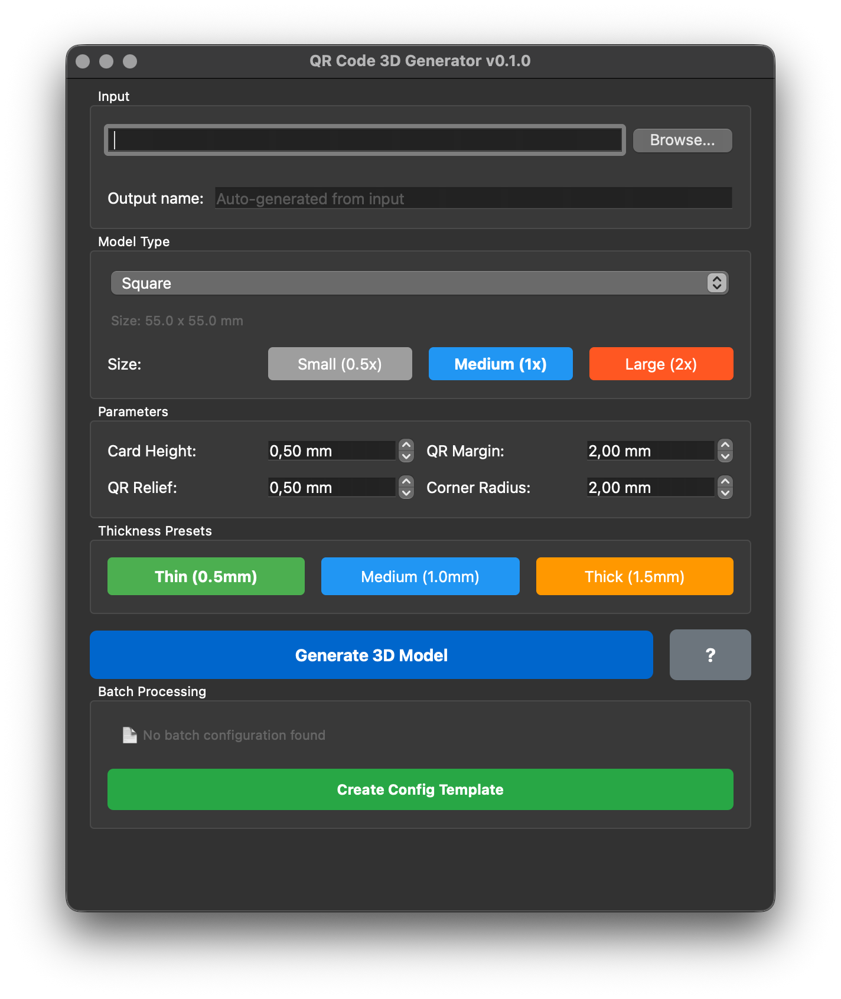

# QR Code 3D Model Generator

Automatically generate 3D-printable QR code models from URLs or PNG/JPG images - with desktop GUI or command line.




## Features

- **Desktop GUI**: User-friendly application with real-time parameter preview
- **Batch Processing**: Automatically generate multiple models via JSON configuration
- **URL Support**: Generate QR codes directly from URLs
- **Four Modes**:
  - Square (55x55mm)
  - Pendant with keychain hole (55x61mm)
  - Rectangle with text (54x64mm)
  - Pendant with text (55x65mm)
- **Text Function**: Optional embossed text (max. 20 characters) below QR code
- **Dynamic Text Sizing**: Automatic scaling 3-6mm based on text length - always fits perfectly!
- **Text Rotation**: 180° rotation for better readability (automatic for Pendant+Text)
- **Optimized Size**: QR code uses almost the entire card surface (minimal margin)
- **Relief QR Code**: Embossed black pixels (1mm)
- **Rounded Corners**: 2mm radius for professional design
- **Lightning-Fast Performance**: ~1 second per model with OpenSCAD 2025+ (126x faster than older versions!)
- **Size Presets**: Quick selection of Small (0.5x), Medium (1x), or Large (2x) model dimensions
- **Thickness Presets**: One-click thickness adjustment - Thin (0.5mm), Medium (1.0mm), or Thick (1.5mm)
- **Automatic STL Generation**: Print-ready output
- **JSON Metadata Export**: Each model gets a JSON file with complete configuration
- **Organized Output**: Each model in its own subfolder with all files (PNG, SCAD, STL, JSON)

### 🌟 Intelligent Text Scaling

The generator uses **intelligent dynamic text scaling** that automatically calculates the optimal font size:

- **Short Text** (1-7 characters): Maximum size of 6mm for optimal readability
- **Medium Text** (8-14 characters): Automatically scaled between 4-5mm
- **Long Text** (15-20 characters): Scaled to minimum 3mm, fits perfectly!

**Examples:**
- "LOGO" → 6.00mm (large and readable)
- "berlinometer" → 4.79mm (balanced)
- "berlinometer.de" → 3.83mm (compact, fits perfectly)
- 20 characters → 3.06mm (smaller but readable)

**Technical Background:**
The calculation considers card size, QR margins, and a 4mm safety buffer. With default settings (qr_margin=0.5mm), all texts from 1-20 characters are **guaranteed** to fit within model boundaries - no overflow, no manual adjustments needed!

## Quick Start

### 1. Installation (one-time)

```bash
# Install OpenSCAD (for STL export)
brew install openscad

# Install Python package (editable mode)
pip install -e .

# Alternative: Use virtual environment
# Python 3.13 virtual environment in venv-gui/
# ./venv-gui/bin/pip install -e .
```

### 2. Start GUI Application (recommended)

```bash
# After pip installation:
qr3d-gui

# Or with virtual environment:
./venv-gui/bin/python -m qr3d.app
```

**GUI Features:**
- Enter URL or select image file
- Choose mode (Square/Pendant/Rectangle+Text/Pendant+Text)
- Optional: Enter text (max 20 characters)
- Adjust parameters (height, margin, relief, corner radius)
- Select size preset: Small (0.5x), Medium (1x), or Large (2x)
- Select thickness preset: Thin (0.5mm), Medium (1.0mm), or Thick (1.5mm)
- Click "Generate 3D Model"
- Track progress in real-time
- Files automatically saved to `generated/`

### 3. Command Line (Alternative)

#### From URL (easiest way):

```bash
# With shell script:
./scripts/qr_generate.sh https://your-website.com --mode pendant --name my-site

# Or directly with Python (after pip install -e .):
qr3d https://your-website.com --mode pendant --name my-site
```

#### From Image File:

```bash
./scripts/qr_generate.sh myqr.png --mode square
```

## Usage

### GUI Application

**Start:**
```bash
./venv-gui/bin/python -m qr3d.app
```

**Operation:**
1. **Input**: Enter URL (e.g., `https://example.com`) or select PNG/JPG file
2. **Output Name**: Optional - automatically derived from URL
3. **Model Type**: Choose from 4 modes:
   - Square (55x55mm) - Classic square
   - Pendant (with hole) - With keychain hole
   - Rectangle + Text (54x64mm) - Rectangle with text field
   - Pendant + Text (55x65mm) - Pendant with text field
4. **Size**: Select preset button:
   - Small (0.5x) - Half size, saves material
   - Medium (1x) - Standard size (recommended)
   - Large (2x) - Double size, better scannability
5. **Text**: For text modes: Enter text (max 20 characters)
6. **Text Rotation** (Rectangle+Text only): Optional "Rotate text 180°" checkbox for upside-down text
   - Pendant+Text automatically rotates text 180°
7. **Adjust parameters**:
   - Card Height: 0.5-5mm (default: 1.25mm)
   - QR Margin: 0-10mm (default: 0.5mm)
   - QR Relief: 0.1-2mm (default: 1mm)
   - Corner Radius: 0-5mm (default: 2mm)
8. **Thickness Presets**: Quick selection:
   - Thin (0.5mm) - Faster printing, less material
   - Medium (1.0mm) - Balanced
   - Thick (1.5mm) - More stable, better readability
9. **Click "Generate 3D Model"**
10. Wait (~1 second with OpenSCAD 2025+)
11. ✅ Success! Files in `generated/model-name/` folder

### Output Organization

Each generated model gets its own subfolder in `generated/`:

```
generated/
├── my-site/
│   ├── my-site.png          # QR code image
│   ├── my-site.json         # Configuration metadata
│   ├── my-site.scad         # OpenSCAD source code
│   └── my-site.stl          # 3D model (print-ready)
└── github-pendant/
    ├── github-pendant.png
    ├── github-pendant.json
    ├── github-pendant.scad
    └── github-pendant.stl
```

**JSON Metadata** contains:
- Timestamp and version
- Used mode (square/pendant/rectangle-text/pendant-text)
- QR input (URL or filename)
- All dimensions (card size, QR size, pixel size, grid)
- All parameters (margins, relief, corner radius)
- Mode-specific data (e.g., hole diameter for pendant)
- Text data (content, size, rotation for text modes)

**Advantage:** Easy reproduction with exactly the same settings!

### Batch Processing (GUI)

For generating multiple models at once, batch functionality is available:

**First-time use:**
1. Start GUI: `./venv-gui/bin/python -m qr3d.app`
2. In "Batch Processing" section, click "Create Config Template"
3. File `batch/config.json` is created with example configuration
4. Customize `batch/config.json` as desired (see below)
5. Click "Start Batch (X models)"
6. Wait until all models are generated

**Config Structure (`batch/config.json`):**
```json
{
  "global_params": {
    "card_height": 1.25,
    "qr_margin": 2.0,
    "qr_relief": 1.0,
    "corner_radius": 2
  },
  "models": [
    {
      "name": "example-square",
      "url": "https://example.com",
      "mode": "square"
    },
    {
      "name": "github-pendant",
      "url": "https://github.com",
      "mode": "pendant"
    },
    {
      "name": "custom-text",
      "url": "https://mysite.com",
      "mode": "rectangle-text",
      "text": "CUSTOM TEXT",
      "text_rotation": 0
    },
    {
      "name": "pendant-with-override",
      "url": "https://wikipedia.org",
      "mode": "pendant-text",
      "text": "WIKI",
      "card_height": 1.5
    }
  ]
}
```

**Important Notes:**
- **global_params**: Default parameters for all models
- **models**: Array with individual model configurations
- Required fields per model: `name`, `url`, `mode`
- Optional: `text`, `text_rotation` (for text modes)
- Optional: Individual parameters (override global_params)
- Status label updates automatically every 5 seconds
- Progress shown in real-time (X/Y models)
- Failed models are skipped, not aborted

### Command Line

#### From URL:

**Basic:**
```bash
./scripts/qr_generate.sh https://example.com
```

**With Options:**
```bash
./scripts/qr_generate.sh https://github.com/user/repo --name github --mode pendant
```

**Website with Parameters:**
```bash
./scripts/qr_generate.sh "https://example.com/profile?user=123" --name profile
```

**With Text (Rectangle+Text):**
```bash
./scripts/qr_generate.sh https://example.com --mode rectangle-text --text "AIMPLICITY" --name mycard
```

**With Text (Pendant+Text):**
```bash
./scripts/qr_generate.sh https://github.com/user --mode pendant-text --text "GitHub" --name github
```

**With Rotated Text (Rectangle+Text):**
```bash
./venv-gui/bin/python -m qr3d https://example.com --mode rectangle-text --text "ROTATED" --text-rotation 180 --name mycard-rot
```

#### From Image File:

**Square:**
```bash
./scripts/qr_generate.sh myqr.png
```

**Pendant:**
```bash
./scripts/qr_generate.sh celox.png --mode pendant
```

**With Custom Output:**
```bash
./scripts/qr_generate.sh qrcode.jpg --mode square --output ./stl_files
```

### Parameters

| Parameter | Description | Default |
|-----------|-------------|---------|
| `input` | QR code image file (PNG/JPG) or URL | *required* |
| `--mode` | Mode: `square`, `pendant`, `rectangle-text`, `pendant-text` | `square` |
| `--text`, `-t` | Text below QR code (max 20 characters, only for *-text modes) | *(empty)* |
| `--text-rotation` | Rotate text 180° (0 or 180, auto for pendant-text) | `0` |
| `--output`, `-o` | Output directory | `generated` |
| `--name`, `-n` | Base name for output files | *derived from input* |

## Modes in Detail

### Square Mode

- **Dimensions**: 55 x 55 x 1.25 mm
- **Margins**: 0.5mm all around (default)
- **QR Code Area**: ~54 x 54 mm
- **QR Relief**: 1mm embossed
- **Use Cases**: Business cards, labels, inserts

```
┌─────────────────┐
│    0.5mm        │
│  ┌─────────┐    │
│.5│ QR Code │.5  │
│  └─────────┘    │
│    0.5mm        │
└─────────────────┘
```

### Pendant Mode

- **Dimensions**: 55 x 61 x 1.25 mm
- **Margins**: 0.5mm (sides/bottom), 8mm (top for hole)
- **Hole**: ⌀5mm, 6mm from top edge
- **QR Code Area**: ~54 x 54 mm
- **QR Relief**: 1mm embossed
- **Use Cases**: Keychains, necklaces, luggage tags

```
┌─────────────────┐
│     6mm    ●    │ ← Hole (⌀5mm)
│     2mm         │
│  ┌─────────┐    │
│.5│ QR Code │.5  │
│  └─────────┘    │
│    0.5mm        │
└─────────────────┘
```

### Rectangle + Text Mode

- **Dimensions**: 54 x 64 x 1.25 mm
- **Margins**: 0.5mm all around
- **QR Code Area**: ~53 x 53 mm
- **QR Relief**: 1mm embossed
- **Text**: Embossed (1mm), dynamic 3-6mm height (auto-scaled), max 20 characters
- **Text Spacing**: 2mm below QR code
- **Font**: Liberation Mono Bold (Monospace)
- **Use Cases**: Business cards, labeled tags, personalized cards

```
┌─────────────────┐
│    0.5mm        │
│  ┌─────────┐    │
│.5│ QR Code │.5  │
│  └─────────┘    │
│   2mm           │
│   TEXT HERE     │ ← Embossed 1mm
│    0.5mm        │
└─────────────────┘
     64mm
```

### Pendant + Text Mode

- **Dimensions**: 55 x ~65 x 1.25 mm (length varies with text)
- **Margins**: 0.5mm (sides/bottom), 8mm (top for hole)
- **Hole**: ⌀5mm, 6mm from top edge
- **QR Code Area**: ~54 x 54 mm
- **QR Relief**: 1mm embossed
- **Text**: Embossed (1mm), dynamic 3-6mm height (auto-scaled), max 20 characters
- **Text Spacing**: 2mm below QR code
- **Font**: Liberation Mono Bold (Monospace)
- **Use Cases**: Personalized keychains, labeled luggage tags

```
┌─────────────────┐
│     6mm    ●    │ ← Hole (⌀5mm)
│     2mm         │
│  ┌─────────┐    │
│.5│ QR Code │.5  │
│  └─────────┘    │
│   2mm           │
│   TEXT HERE     │ ← Embossed 1mm
│    0.5mm        │
└─────────────────┘
    ~65mm
```

## Design Specifications

| Property | Value |
|----------|-------|
| Card Width | 55mm (ISO 7810) or 54mm (Rectangle-Text) |
| Card Height | 1.25mm (adjustable via thickness presets) |
| QR Code Relief | 1mm embossed |
| Corner Radius | 2mm |
| Margin Width | **0.5mm** (default, adjustable 0-10mm) |
| QR Code Border | **1 module** (minimal for maximum area) |
| Top Margin (Pendant) | 8mm |
| Hole Diameter | 5mm |
| Hole Position | 6mm from top edge, horizontally centered |
| **Text Size** | **3-6mm** (dynamically scaled based on text length) |
| **Text Relief** | **1mm** (same as QR code) |
| **Text Spacing** | **2mm** (distance to QR code) |
| **Text Font** | **Liberation Mono Bold** (Monospace) |
| **Text Rotation** | **0° or 180°** (Rectangle: selectable, Pendant: automatic 180°) |

## Output Files

All generated files are automatically placed in the **`generated/`** folder.

For input `https://example.com` with `--name example`:

- **`generated/example.png`**: QR code image (for URL input)
- **`generated/example-model.scad`**: OpenSCAD source file (editable, parametric)
- **`generated/example-model.stl`**: 3D print file (directly printable)

## Performance

### Generation Time

The system uses intelligent **pixel sampling** for optimal performance:

| Phase | Time | Description |
|-------|------|-------------|
| QR Code Generation | < 1 sec | PNG from URL or load image |
| OpenSCAD File | < 1 sec | Generate .scad code |
| STL Rendering (2025+) | **~1 sec** | OpenSCAD compiles to STL |
| STL Rendering (older) | ~1-2 min | Older OpenSCAD versions |
| **Total (2025+)** | **~2-3 seconds** | Per model with OpenSCAD 2025+ |
| **Total (older)** | **~1:30 minutes** | Per model with older OpenSCAD |

### Optimizations

**1. Pixel Sampling**
- Original QR: 100x100 pixels → ~10,000 3D cubes → 2-5 min
- Optimized: 50x50 grid → ~800-1,200 cubes → **1-2 min** ✅
- **10-30x faster** without quality loss!

**2. Minimal QR Border**
- Standard: 4 modules border (QR spec)
- Optimized: **1 module** border ✅
- Result: QR code uses ~54x54mm instead of ~51x51mm

**3. Adjusted OpenSCAD $fn Value**
- Reduced to 12 for faster rendering
- Sufficient for rounded corners

#### Why does this work?

- **Error Correction Level H**: 30% error tolerance
- **3D Print Resolution**: Finer details not visible anyway
- **Physical Margin**: 0.5mm card margin replaces QR border
- **Result**: Faster, larger, just as scannable!

## Workflow: From URL to 3D Print

### Option A: GUI (recommended for beginners)

1. Start GUI: `./venv-gui/bin/python -m qr3d.app`
2. Enter URL: `https://your-website.com`
3. Choose mode: Pendant
4. Select size: Medium (1x) or adjust as needed
5. Select thickness: Medium (1.0mm) or adjust as needed
6. Review parameters (or use defaults)
7. Click "Generate 3D Model"
8. ✅ Success! → Open `generated/your-website-model.stl` in slicer
9. Print!

### Option B: Command Line (fast for pros)

```bash
./scripts/qr_generate.sh https://your-website.com --mode pendant --name my-site
# Wait ~1-3 seconds (OpenSCAD 2025+)
# → generated/my-site-model.stl is ready!
```

### 3D Print Settings

**Material**: PLA, PETG, or flexible filament

**Slicer Settings:**
- Layer Height: **0.2mm** or finer for details
- Infill: **20%** sufficient
- Support: **Not needed**
- Brim/Raft: Optional for better adhesion
- Print Speed: Normal

**Two-Color Print (recommended):**
1. Print up to 1.25mm (base plate) in **White**
2. Pause (M600 or manual)
3. Change filament to **Black**
4. Continue → QR code becomes black = best contrast!

## Tips for Best Scan Results

### Material & Color:
- ✅ **Matte** instead of glossy (fewer reflections)
- ✅ **Black/White contrast** for optimal scanning
- ✅ **PLA** for precise details
- ❌ Transparent or very dark single-color prints

### QR Code Generation:
- **Error Correction**: Level H (30% tolerance) - set automatically
- **Short URLs**: Less complex QR codes scan better
- **URL Shorteners**: e.g., bit.ly for longer URLs

### Post-Processing (optional):
- **Painting**: Acrylic paint for contrast (black on white)
- **Sealing**: Matte clear coat for protection
- **Deburring**: Sand sharp edges

## Customization

### In the GUI:
All parameters directly adjustable:
- **Card Height**: 0.5-5mm (thinner/thicker) - or use thickness presets
- **QR Margin**: 0-10mm (border around QR code)
- **QR Relief**: 0.1-2mm (height of QR code)
- **Corner Radius**: 0-5mm (corner rounding)
- **Size Scale**: Quick buttons for Small (0.5x), Medium (1x), Large (2x)
- **Thickness**: Quick buttons for Thin (0.5mm), Medium (1.0mm), Thick (1.5mm)

### Edit OpenSCAD File:
The `.scad` file can be opened in OpenSCAD for:
- Adjust dimensions
- Add text
- Integrate logo
- More complex shapes

## Project Structure

```
QRs/
├── src/
│   └── qr3d/                  # Python Package
│       ├── __init__.py        # Package Init (Version 0.1.0)
│       ├── app.py             # Desktop GUI (START HERE!)
│       ├── generator.py       # Backend Generator
│       ├── __main__.py        # CLI Entry Point
│       └── gui/
│           ├── __init__.py
│           └── viewer_widget.py  # 3D Viewer Component
├── scripts/
│   └── qr_generate.sh         # Shell Wrapper for CLI
├── tests/                     # Test Suite (pytest)
│   ├── test_generator.py
│   └── test_version.py
├── venv-gui/                  # Python 3.13 Virtual Environment
├── generated/                 # All Generated Files
├── pyproject.toml             # Package Configuration
├── pytest.ini                 # Test Configuration
├── qr3d.spec                  # PyInstaller Build Spec
├── README.md                  # This File
├── INSTALL.md                 # Installation Guide
└── CLAUDE.md                  # AI Context for Claude Code
```

## Technology Stack

- **Python 3.13** (venv-gui)
- **PyQt6** - Desktop GUI Framework
- **Pillow** - Image Processing
- **qrcode** - QR Code Generation
- **OpenSCAD** - 3D Model Rendering

## Troubleshooting

### GUI doesn't start
```bash
# Check Python version
./venv-gui/bin/python --version
# Should be: Python 3.13.x

# Reinstall dependencies
./venv-gui/bin/pip install -r requirements-gui.txt
```

### "OpenSCAD not found"
```bash
# macOS
brew install openscad

# Linux
sudo apt install openscad

# Windows
# Download from openscad.org
```

**Workaround**: Without OpenSCAD, only `.scad` file is created. Open manually in OpenSCAD GUI and export to STL.

### QR code not recognized when scanning
- **Too little contrast**: Use two-color print
- **Too glossy**: Use matte filament
- **Too small**: Minimum 45x45mm QR code area
- **Print quality**: 0.2mm layer height or finer

### "Image file not found" for URL input
- Using GUI? URLs are detected automatically
- CLI: Use `--name` parameter for custom naming
- Check if `generated/` folder exists

### Model too large/small
- In GUI: Use size presets (Small/Medium/Large) or adjust Card Height parameter
- In .scad file: Edit values at beginning
- Re-export

## License

MIT License

Copyright (c) 2025 Martin Pfeffer

Permission is hereby granted, free of charge, to any person obtaining a copy of this software and associated documentation files (the "Software"), to deal in the Software without restriction, including without limitation the rights to use, copy, modify, merge, publish, distribute, sublicense, and/or sell copies of the Software, and to permit persons to whom the Software is furnished to do so, subject to the following conditions:

The above copyright notice and this permission notice shall be included in all copies or substantial portions of the Software.

THE SOFTWARE IS PROVIDED "AS IS", WITHOUT WARRANTY OF ANY KIND, EXPRESS OR IMPLIED, INCLUDING BUT NOT LIMITED TO THE WARRANTIES OF MERCHANTABILITY, FITNESS FOR A PARTICULAR PURPOSE AND NONINFRINGEMENT. IN NO EVENT SHALL THE AUTHORS OR COPYRIGHT HOLDERS BE LIABLE FOR ANY CLAIM, DAMAGES OR OTHER LIABILITY, WHETHER IN AN ACTION OF CONTRACT, TORT OR OTHERWISE, ARISING FROM, OUT OF OR IN CONNECTION WITH THE SOFTWARE OR THE USE OR OTHER DEALINGS IN THE SOFTWARE.

## Support

For questions or issues:
1. Read README completely
2. Check INSTALL.md
3. Create issue on GitHub: https://github.com/pepperonas/qr-2-3d
4. Or contact developer

---

**Happy Printing! 🎯**

**Developer:** Martin Pfeffer (https://github.com/pepperonas)
**Year:** 2025
*Developed with Claude Code - Optimized for maximum QR code area and performance*
